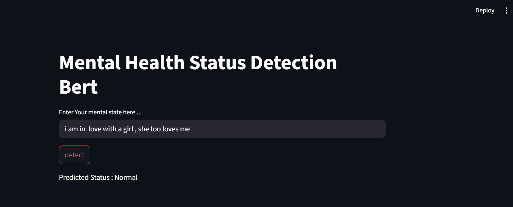

## 🖼 Streamlit Demo

🧠 Mental Health Text Classification — Fine-Tuning BERT

An end-to-end NLP project for detecting anxiety and depression in user-generated text using a fine-tuned BERT model. The project includes data cleaning, model training, evaluation, and deployment through a simple Streamlit web app.

📌 Project Overview

This project classifies mental health-related text into categories  'Anxiety', 'Normal', 'Depression', 'Suicidal', 'Stress', 'Bipolar',
'Personality disorder' using the pre-trained bert-base-uncased model from Hugging Face. It demonstrates a complete pipeline from preprocessing to deployment.

🛠️ Tech Stack :Python, BERT (bert-base-uncased), Scikit-learn, NLTK, Streamlit

## 🔄 Workflow

### **Data Preprocessing**
- Cleaned raw text using regular expressions  
- Removed stopwords using NLTK  
- Applied label encoding to class labels  
- Balanced classes using `RandomOverSampler` from `imblearn`  

### **Tokenization**
- Used `BertTokenizer` with:
  - Padding  
  - Truncation  
  - Max sequence length: 200 tokens  

### **Model Training**
- Fine-tuned `bert-base-uncased` using Hugging Face’s `Trainer` API  
- Used GPU (if available) for acceleration  

### **Evaluation**
- Generated a classification report (precision, recall, F1-score)  
- Visualized confusion matrix using Seaborn heatmap  

### **Deployment**
- Deployed a Streamlit web app for real-time predictions  
- Used the fine-tuned BERT model and the same preprocessing pipeline  
